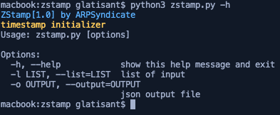

# ZStamp | Timestamp Initializer

## Screenshots

## Instructions for running
1. Run `python3 zstamp.py`. 

**COMPATIBILITY TESTED ON ARCHLINUX(x64) & DEBIAN(x64) ONLY** 
**FEEL FREE TO SUBMIT PULL REQUESTS**